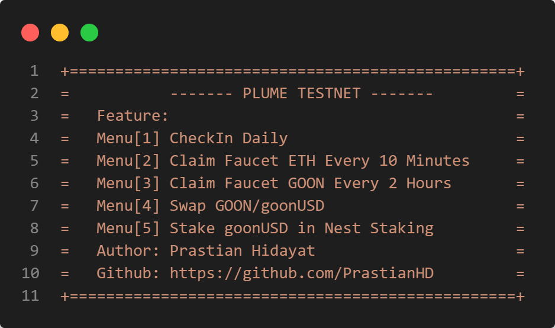

# Plume Testnet Script


## Join
https://miles.plumenetwork.xyz/join?invite=PLUME-6KCXQ

## Menu Explanation
### Menu[1] Check-In
- After doing CheckIn, each wallet will claim NEST STAKING rewards
- Each wallet in PRIVATE_KEYS will take turns checking in, then return to the Main Menu.
### Menu[2] Claim ETH Faucet
- Each wallet in PRIVATE_KEYS will take turns Fauceting ETH using a different proxy for each wallet, then return to the Main Menu
### Menu[3] Claim GOON Faucet
- Each wallet in PRIVATE_KEYS will take turns Fauceting GOON using a different proxy for each wallet, then return to the Main Menu
### Menu[4] Swap GOON/goonUSD
- After one wallet swap, wait 5 seconds before moving to the next wallet.
- After all wallets swap GOON to goonUSD, then return to the Main Menu.
- Swap amount can be adjusted in .env
### Menu[5] Stake goonUSD
- The stake amount is automatically all in according to the goonUSD balance in the wallet.
- After all wallets stake, then return to the Main Menu.
- The stake amount can be adjusted in .env
### Menu[6] ETH/USD BTC/USD ARB/USD Price Prediction
- All wallets take turns predicting whether the price will go up or down
- The wallet automatically randomly chooses whether to pair ETH or BTC or ARB, then returns to the Main Menu.
### Menu[7] Create Tokenized RWA Assets
- All wallets take turns creating RWA tokens
- The wallet automatically randomly chooses to create RWA according to what is in `datarwa.json` starting from the types of Card, Real Estate, Art, sneakers, and others. You can also change the data if you want it to be different
### Menu[8] Running All Task
- Each wallet will do CheckIn, Claim GOON Faucet, Swap GOON/goonUSD, claim stake rewards and stake goonUSD, and predict the price randomly.
- Then each wallet will delay for 1 hour to avoid ETH faucet transaction failure
- After 1 hour delay, each wallet will create RWA tokens and Claim ETH Faucet.
- Then delay again for 1 hour which will return to the previous Task

Penjelasan dalam bahasa Indonesia : [DISINI!](https://github.com/PrastianHD/plume-testnet/blob/main/READINDO.md)

## Installation 
### Clone Repositori
```
git clone https://github.com/PrastianHD/plume-testnet.git
cd plume-testnet
```

### Instal Dependensi
```
npm install
```

### Konfigurasi File

>create file .env in root project
```bash
PRIVATE_KEYS=your_private_key,your_private_key

# Minimum and maximum swap values
MIN_SWAP=0.099
MAX_SWAP=0.1

```
### Konfigurasi Proxy di proxy.txt
```bash
# Format Proxy - username:password:host:port
 
skrstvca:qwo3xoup86cg:204.44.69.89:6342
```

### Run script
```
npm start
```
